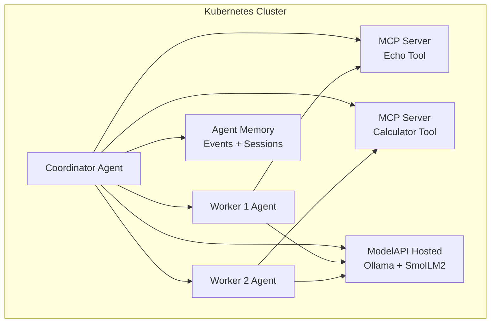

# KAOS Starter - Kubernetes Multi-Agent System

[](https://github.com/axsaucedo/kaos)
[](https://kubernetes.io/)
[](https://modelcontextprotocol.io/)
[](https://tirth1263.github.io/kaos-starter/)

KAOS Starter is a deployment-ready example of a Kubernetes-native multi-agent
system built with [KAOS](https://github.com/axsaucedo/kaos). It creates a
coordinator agent, two worker agents, MCP tool servers, agent memory support,
and a hosted in-cluster model layer powered by Ollama and SmolLM2.

The goal is simple: give you a clean starter that shows how AI agents can be
defined, deployed, connected, and tested as first-class Kubernetes resources.

## What this starter showcases

- Kubernetes-native AI agents defined as KAOS custom resources.
- A coordinator-worker topology for multi-agent delegation.
- MCP tool integration with echo and calculator tools.
- Memory-ready agent endpoints for events and sessions.
- A default local model path using KAOS Hosted `ModelAPI`, Ollama, and
  `smollm2:135m`.
- An optional Nebius proxy manifest that mirrors the hosted-provider flow from
  the reference starter.
- Bash and PowerShell scripts for repeatable setup.
- A published project website: <https://tirth1263.github.io/kaos-starter/>

## Architecture



## Repository structure

```text
.
|-- app/                         # Next.js website source
|-- components/                  # Website UI components
|-- docs/
|   |-- architecture.md          # Deeper architecture notes
|   `-- troubleshooting.md       # Common cluster fixes
|-- examples/                    # Example request payloads
|-- manifests/
|   |-- multi-agent-system.yaml  # Default Ollama + SmolLM2 deployment
|   |-- nebius-proxy-system.yaml # Optional Nebius proxy deployment
|   `-- kustomization.yaml
|-- scripts/
|   |-- install-kaos.sh
|   |-- install-kaos.ps1
|   |-- deploy.sh
|   |-- deploy.ps1
|   |-- cleanup.sh
|   `-- cleanup.ps1
`-- README.md
```

## Prerequisites

- Kubernetes cluster: Docker Desktop, KIND, Minikube, or a managed cluster.
- `kubectl` configured for your cluster.
- Helm 3.x.
- Enough cluster resources to run the KAOS operator, agents, MCP servers, and
  the hosted Ollama model runtime.

For more KAOS installation options, see the
[KAOS Installation Guide](https://github.com/axsaucedo/kaos#installation).

## Quick start

### 1. Install the KAOS operator

```bash
helm repo add kaos https://axsaucedo.github.io/kaos/charts
helm repo update

helm upgrade --install kaos kaos/kaos-operator \
  --namespace kaos-system \
  --version v0.1.3 \
  --create-namespace
```

Verify the operator:

```bash
kubectl get pods -n kaos-system
```

You can also use the helper script:

```bash
./scripts/install-kaos.sh
```

PowerShell:

```powershell
.\scripts\install-kaos.ps1
```

### 2. Deploy the default Ollama multi-agent system

```bash
kubectl apply -f manifests/multi-agent-system.yaml
```

Or use the helper script:

```bash
./scripts/deploy.sh ollama
```

PowerShell:

```powershell
.\scripts\deploy.ps1 -Provider ollama
```

### 3. Wait for resources to become ready

```bash
kubectl get agent,modelapi,mcpserver -n kaos-demo -w
kubectl get pods -n kaos-demo
```

The first Ollama-backed start can take a little longer while the model runtime
pulls `smollm2:135m`.

### 4. Call the coordinator agent

List services:

```bash
kubectl get svc -n kaos-demo
```

Port-forward to the coordinator service:

```bash
kubectl port-forward -n kaos-demo svc/agent-coordinator 8080:8000
```

If your KAOS version exposes the service as `svc/coordinator`, use that service
name instead.

Send a chat completion request:

```bash
curl http://localhost:8080/v1/chat/completions \
  -H "Content-Type: application/json" \
  -d @examples/delegation-task.json
```

## View agent memory

After sending requests, inspect events and sessions:

```bash
curl "http://localhost:8080/memory/events?limit=20"
curl "http://localhost:8080/memory/sessions"
```

## Call an MCP tool directly

Port-forward to the echo MCP server:

```bash
kubectl port-forward -n kaos-demo svc/demo-echo-mcp 8081:8000
```

Call the echo tool:

```bash
curl http://localhost:8081/mcp/call \
  -H "Content-Type: application/json" \
  -d @examples/mcp-echo.json
```

## Optional: deploy the Nebius proxy variant

The reference starter shows a Nebius-backed proxy `ModelAPI`. This repo includes
that path as `manifests/nebius-proxy-system.yaml`.

Create the namespace and secret:

```bash
kubectl create namespace kaos-demo --dry-run=client -o yaml | kubectl apply -f -
export NEBIUS_KEY="your-api-key"
kubectl create secret generic nebius-secrets \
  -n kaos-demo \
  --from-literal "api-key=$NEBIUS_KEY" \
  --dry-run=client -o yaml | kubectl apply -f -
```

Apply the Nebius proxy system:

```bash
kubectl apply -f manifests/nebius-proxy-system.yaml
```

Or use the helper:

```bash
NEBIUS_KEY="your-api-key" ./scripts/deploy.sh nebius
```

PowerShell:

```powershell
$env:NEBIUS_KEY = "your-api-key"
.\scripts\deploy.ps1 -Provider nebius
```

## Website

This repository includes a static-export Next.js website for the project.

Run locally:

```bash
npm install
npm run dev
```

Build for GitHub Pages:

```bash
npm run build:pages
```

The published site is available at:

<https://tirth1263.github.io/kaos-starter/>

## Clean up

```bash
./scripts/cleanup.sh
```

PowerShell:

```powershell
.\scripts\cleanup.ps1
```

## References

- [Reference starter in awesome-ai-apps](https://github.com/Arindam200/awesome-ai-apps/tree/main/starter_ai_agents/kaos_starter)
- [KAOS repository](https://github.com/axsaucedo/kaos)
- [KAOS quick start docs](https://axsaucedo.github.io/kaos/v0.2.3/getting-started/quickstart.html)
- [SmolLM2 on Ollama](https://ollama.com/library/smollm2)

## License

MIT

