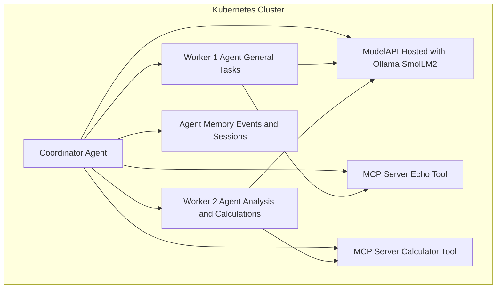

# Architecture

KAOS Starter deploys a small but realistic multi-agent system as Kubernetes
custom resources. The default path keeps the model inside the cluster through a
KAOS Hosted `ModelAPI` running Ollama with `smollm2:135m`.

## Resource roles

- `ModelAPI/ollama-smollm2`: hosts the default local model path through Ollama.
- `MCPServer/demo-echo-mcp`: installs the package-backed echo test tool.
- `MCPServer/demo-calc-mcp`: exposes a safe arithmetic calculator function.
- `Agent/coordinator`: receives incoming requests and delegates to workers.
- `Agent/worker-1`: handles general purpose delegated tasks.
- `Agent/worker-2`: handles analysis and arithmetic delegated tasks.

## Optional hosted provider path

`manifests/nebius-proxy-system.yaml` keeps the same coordinator and worker
topology but swaps the model layer to a KAOS Proxy `ModelAPI`. It expects a
`nebius-secrets` secret in the `kaos-demo` namespace and routes models through
the `nebius` provider.
